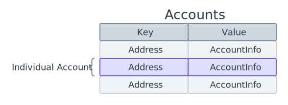
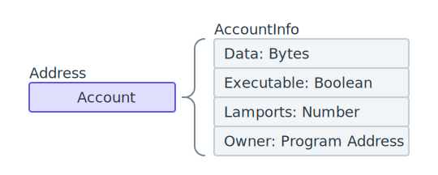
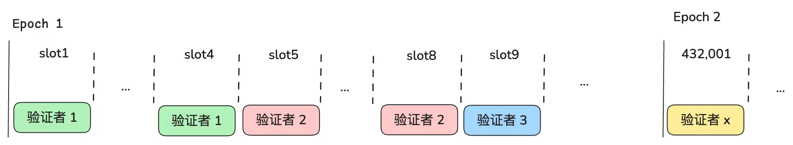
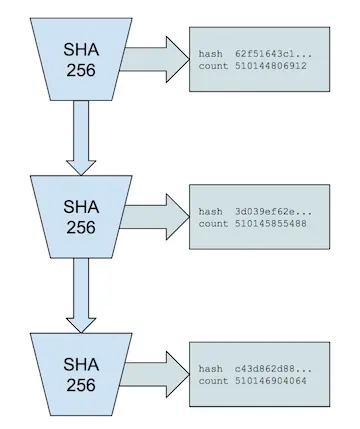
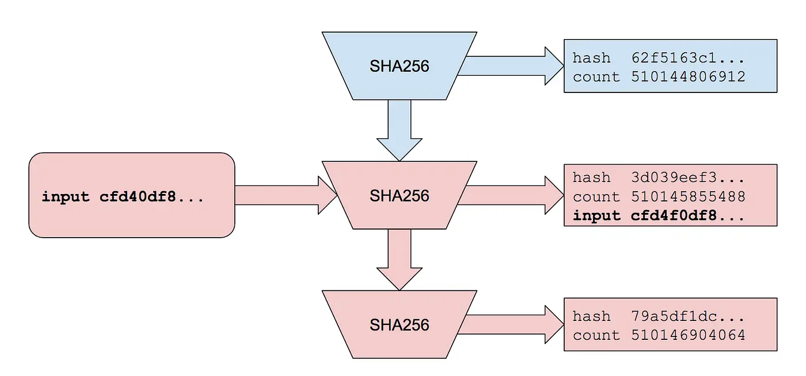
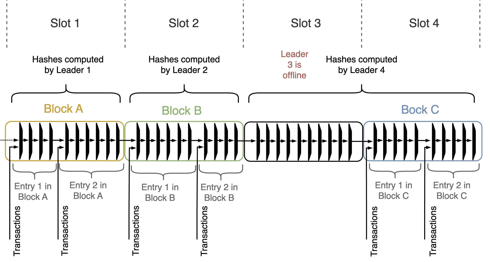
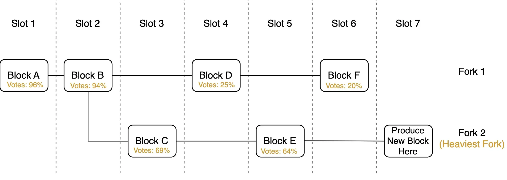

# Solana 开发学习之 Solana 基础知识

## **eBPF: Solana交易的执行基石**

以太坊上的智能合约通常使用高级语言Solidity来编写，而Solidity编译产生的字节码则运行在一个叫做以太坊虚拟机EVM的环境中。

Solana使用eBPF， eBPF能够以即时编译（JIT）模式直接将字节码转换成处理器可以直接执行的机器指令，从而更高效地运行程序。
eBPF拥有一套高效的指令集和成熟的基础设施。开发者只需要使用Rust语言即可编写智能合约。
LLVM编译框架提供了一个eBPF的后端，利用它可以直接将这些Rust语言编写的程序编译成可运行在eBPF虚拟机上的字节码。

## Solana账户模型

Solana上的数据以账户的形式存储。如下图所示，我们可将Solana中的所有数据视作一个庞大的键值对数据库。数据库的键是账户的地址，对于“钱包”账户（即由Solana用户通过公私钥对直接控制的账户）而言，这个地址是使用Ed25519签名系统生成的公钥；而数据库的值是该账户的具体信息，包含余额和其它相关信息。

Solana使用名为AccountInfo的结构来描述一个账户，其组成如下图所示。



Solana中的每个账户均包含四个字段。这里我们对其进行逐一解释。

```
*   **Data字段**存储了该账户有关的数据。如果该账户为一个程序（即智能合约），则它存储的其实就是eBPF字节码。否则，Data中信息格式一般由账户创建者自行定义。
    
*   **Executable字段**用于标识该账户是否为程序。需要注意的是，与以太坊不同，Solana中的程序是可以更新的。
    
*   **Lamports字段**记录了该账户Solana代币的余额。Lamports实际上是SOL Token的最小单位（1 SOL = 10亿Lamports）。
    
*   **Owner字段**指示了当前账户的拥有者。在Solana中，任何一个账户都有一个“Owner”。例如，所有“钱包”账户的拥有者都是System Program，这是Solana网络上的一个特殊账户，负责账户创建等功能。账户拥有者是唯一能够修改账户数据和扣除Lamports余额的人（但任何人都可以增加Lamports，即向账户执行转账功能）。
```

## Solana 共识 - 如何出块

注：Solana 共识算法文档有些过时，这部分的内容是参考 [深入Solana共识](https://learnblockchain.cn/article/10458) 加上我理解。

Solana 是一条权益证明（PoS）区块链，共识算法遵循两阶段：1. 选出验证者出块 2. 其他验证者对块进行投票，积累了足够多投票之后，区块被最终确认。

### 选出验证者
在 Solana 的协议中，有两个重要时间间隔相关的词：Epoch 与 时隙（slot）：

时隙（slot）： 验证者生成区块的时间单位。每个时隙可以生成一个区块，每个时隙持续 400 毫秒。
Epoch： 在每个Epoch 开始时，Solana 网络会根据质押权重和之前的区块随机选举出一个验证者（称为领导者Leader）序列 ， 这个领导者序列负责在该Epoch 内出块，领导者序列在此期间保持固定，每个领导者可以连续处理 4 个 Slot（即出 4 个块)，每个Epoch大约持续两天（包含 432,000 个 Slot）。直到下一个Epoch 重新产生领导者 Leader。


`上图中，每个有颜色的块表示一个区块，不同的颜色表示不同的验证出的块。`

随机选举这里不细说（主要是不懂），在每个 Epoch 开始时，验证者就会知道在哪些 slot 需要他来出块。

但是这里有两个问题需要解决：

验证者怎么知道该轮到自己出块了？ 如果只依靠网络通信，由上一个验证者告诉下一个验证者，很可能由于网络延迟（或上一个验证者掉线了）错过宝贵的出块时间，毕竟出块时间只有 0.4 秒。

如何在一个块里面，塞入尽可能多的交易。如果类似以太坊一个交易一个交易接着执行，这么短的时间里，是放不了很多交易的。

Solana 最重要的创新 - POH ， 主要就是用来解决这两个问题的。

### 出块
Solana 为了实现高性能，引入了并行处理交易， 把交易的排序和执行分成了两个阶段，这样执行阶段就可以并行处理了。

其他验证者在验证交易时，也是按照同样的排序序列来执行验证，为了让交易排序序列可以被验证， Solana 使用 POH 历史证明哈希链的方式来确定交易的顺序。



PoH 通过创建一系列加密哈希（SHA256 算法），每次哈希计算都需要使用前一个哈希值，这样就可以确保下一个哈希总是在上一个哈希之后发生，因此 POH 哈希链结合交易数据就可以确定交易次序。



只需要在计算哈希时，加入交易数据作为输入的一部分，就可以确定交易的序列。而且这个序列是可并行可验证和不可篡改的。

当前的领导验证者会不停从 RPC服务器和其他的验证者那里接收交易，做了初步的验证（如验证交易签名和账户余额）之后，就会加入的 POH 哈希链的计算当中排序，即给每笔交易打上一个全局、可验证的时间顺序标签，然后再对交易进行并行执行。

在 Solana 中，整个交易处理流程被拆分成多个相互衔接的阶段（交易验证阶段、POH 排序阶段、执行阶段、广播阶段），形成一个流水线（pipeline）。不同阶段之间可以并行、重叠地处理不同批次的交易，就不同 CPU 核或 GPU 在同时处理某一批交易的验证核另一批交易的执行（称为banking）。

交易的执行也是并行的，交易执行基于账户的读写依赖来安排并行度，将交易按照依赖分组，并行的放进不同线程/CPU 核心/GPU 任务中执行。

`若两笔交易操作的账户完全不同或都是只读，理论上可以同时执行；如果存在写冲突，则必须按顺序执行，避免数据不一致。`

现在我们明白了 Solana 出块的过程，这个如上的方式，Solana 在单个 Slot（约 400ms）内能够处理大量交易。

### POH - 同步时钟
还有一个问题，验证者怎么知道该轮到自己出块了？

每次哈希操作都是需要最小时间，且每次哈希计算都需要使用前一个哈希值。这确保了无法进行并行化。因此PoH 哈希链，可以作为时间流逝的证明。

在 Solana 中，每个区块（的PoH 哈希链）必须包含 12,500 个哈希。当前Slot 的领导者负责生成这些 PoH 链（区块）。

实际上，每个验证者都在后台自己计算着 PoH 链（没有交易数据的空 Hash 链），如果前一个领导者（或多个前领导者）未发布区块（或者当前领导者未收到），只要经过 Slot 要求的哈希数量，当前领导者就可以按时生成区块。

如下图 Slot3 离线，Slot4 的验证者为 slot3 填充 PoH 序列。


### 验证和投票区块
区块的验证过程包括验证区块元数据和重新计算 PoH 哈希，会验证并重放来自区块的所有交易，并更新账本。

验证通过后，通过投票表示验证者对一个区块的承诺，验证者持有的委托权益（币）越多，投票的权重就越大。

通常，验证者会选择最重的链出块和投票，如果出现了前一个领导者的区块未能到达当前领导者， 则可能会出现分叉的情况：



在分叉的情况下，验证者会为每个子树计算总的按股份加权投票，并选择投票最多的那个。如果一个区块获得至少三分之二的持权加权投票，则该区块被确认。

### 转账

| 特性      | 创建受程序管理的账户               | 使用 CPI                 |
|----------|------------------|----------------------|
| 灵活性 | 程序完全控制账户 | 程序受系统程序的限制 |
| 存储成本  | 需要支付新账户的存储费用        | 无额外存储费用  |
| 开发复杂度  | 需要管理多个账户        | 较为简单，直接调用系统程序  |
| 安全性  | 程序外部无法直接操作中转账户       | 钱包账户操作依赖程序逻辑，存在潜在风险  |

例子： https://github.com/solana-developers/program-examples/blob/main/basics/transfer-sol/anchor/programs/transfer-sol/src/lib.rs 

### IDL

IDL 是 Interface Definition Language 的缩写，主要用于 Anchor 框架，其作用类似于智能合约的“说明书”。是一个标准化的 JSON 文件，用于描述程序的指令（可以理解为函数）和账户。它类似于以太坊的 ABI 文件，帮助我们与智能合约交互。


### 常见词语
| 平台      | 作用               | 主要特点                 | 风险               |
|----------|------------------|----------------------|----------------|
| Pump.fun | 一键创建和交易代币 | 快速发币 + 自动流动性管理 | 可能有诈骗代币       |
| Raydium  | DEX + AMM        | 结合 Serum 订单簿流动性  | LP 可能遭无常损失    |
| Jupiter  | DEX 聚合器         | 获取最优交易价格         | 依赖外部流动性池     |
| Orca     | 友好型 AMM        | 简单易用 + 低滑点        | 智能合约风险        |

如果你要进行 Solana 生态交易，Jupiter + Raydium 是最常用的组合。 
Orca 适合小额交易，Pump.fun 适合新代币投机（但风险较高）。
